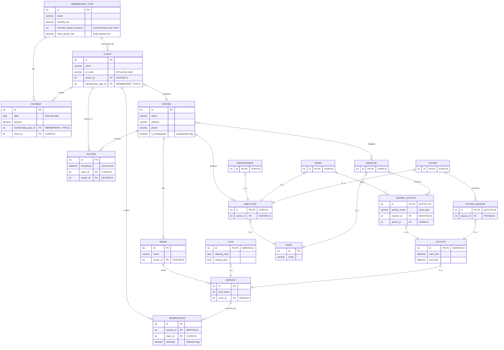

# MEMORIA

## E-R MODEL

```mermaid

erDiagram
    MEMBERSHIP_TYPE ||--o{ PAYMENT : fee
    MEMBERSHIP_TYPE ||--o{ CLIENT : subscribed_by
    CLIENT ||--o{ PAYMENT : makes

    CLIENT }o--|| CENTER : assigned
    CLIENT ||--o{ ACCESS : checks_in
    CENTER ||--o{ ACCESS : records

    CENTER ||--|{ ROOM : has
    ROOM ||--o{ SERVICE : hosts

    GYM |o--|| SERVICE : is_a
    ACTIVITY |o--|| SERVICE: is_a

    GUIDED_ACTIVITY |o--|| ACTIVITY : is_a
    PHYSIO_SESSION |o--|| ACTIVITY : is_a


    CENTER ||--o{ EMPLOYEE : employs
    CENTER }o--o{ MONITOR : engages

    EMPLOYEE |o--|| STAFF : is_a
    MONITOR |o--|| STAFF : is_a

    MAINTENANCE |o--|| EMPLOYEE : is_a
    ADMIN |o--|| EMPLOYEE : is_a
    PHYSIO |o--|| EMPLOYEE : is_a

    ADMIN ||--o{ GUIDED_ACTIVITY : plans
    MONITOR ||--o{ GUIDED_ACTIVITY : teaches
    PHYSIO ||--o{ PHYSIO_SESSION : conducts
    CLIENT ||--o{ RESERVATION : makes

    SERVICE ||--o{ RESERVATION : reserved_by

    MEMBERSHIP_TYPE {
        int id PK
        varchar name
        decimal monthly_fee
        int included_physio_sessions "Included physio per week"
        decimal extra_physio_fee "Extra session fee"
    }

    PAYMENT {
        int id PK
        date date "Payment date"
        decimal amount
        int membership_type_id FK "MEMBERSHIP_TYPE.id"
        int client_id FK "CLIENT.id"
    }

    CLIENT {
        int id PK
        varchar name
        varchar qr_code "QR access code"
        int center_id FK "CENTER.id"
        int membership_type_id FK "MEMBERSHIP_TYPE.id"
    }

    ACCESS {
        int id PK
        datetime timestamp "Access time"
        int client_id FK "CLIENT.id"
        int center_id FK "CENTER.id"
    }

    CENTER {
        int id PK
        varchar name
        varchar address
        varchar phone
        boolean is_headquarter "Headquarter flag"
    }
    ROOM {
        int id PK
        varchar name
        int center_id FK "CENTER.id"
    }
    SERVICE {
        int id PK
        int max_users
        int room_id FK "ROOM.id"
    }
    GYM {
        int id PK, FK "SERVICE.id"
        time opening_time
        time closing_time
    }
    ACTIVITY {
    int id PK, FK "SERVICE.id"
    datetime start_time
    datetime end_time
    }
    GUIDED_ACTIVITY {
        int id PK, FK "ACTIVITY.id"
        varchar activity_name "Class type"
        int monitor_id FK "MONITOR.id"
        int admin_id FK "ADMIN.id"
    }
    PHYSIO_SESSION {
        int id PK, FK "ACTIVITY.id"
        int physio_id FK "PHYSIO.id"
    }
    STAFF {
        int id PK
        varchar name
    }
    EMPLOYEE {
        int id PK,FK "STAFF.id"
        int center_id FK "CENTER.id"
    }
    ADMIN {
        int id PK, FK "STAFF.id"
    }

    MONITOR {
        int id PK, FK "STAFF.id"
    }
    MAINTENANCE {
        int id PK, FK "STAFF.id"
    }

    PHYSIO {
        int id PK, FK "STAFF.id"
    }


    RESERVATION {
        int id PK
        int service_id FK "SERVICE.id"
        int client_id FK "CLIENT.id"
        boolean attended "Attended flag"
    }
    


```

### Fisio y Rehabilitación son una sola actividad
### QR establecido para cada cliente (se guarda, no se genera)
